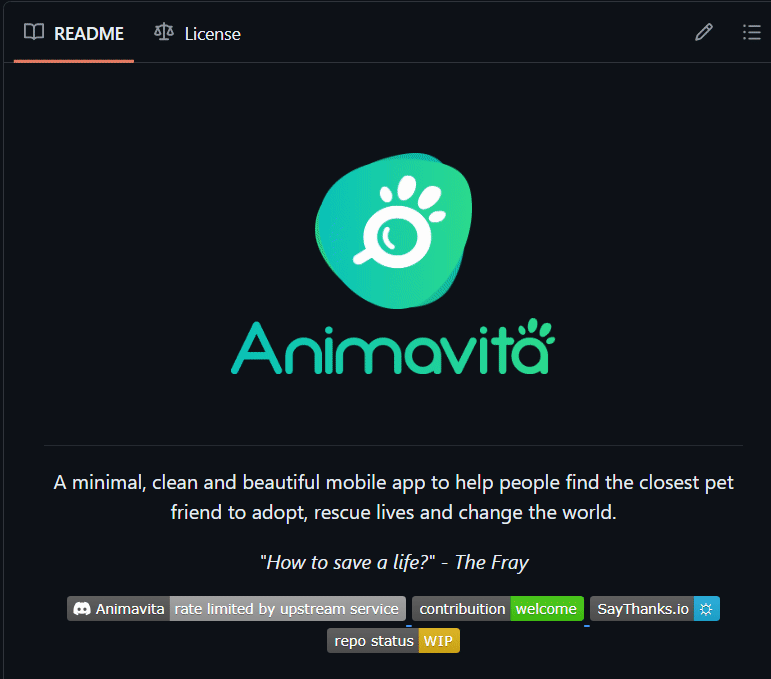

# Projeto com README
Um projeto de teste com um arquivo README 🚀
[](https://github.com/refinedev/refine)

[](https://github.com/Andre-Chaibe-21/animavita)

## Tecnologia utilizadas
- HTML
- CSS
- JS

### Como utilizar

1 - Clone para o projeto :

```
git clone <url>
 ```
2 - Acesse a pasta do projeto :

``
cd repositorio-com-readme
``


